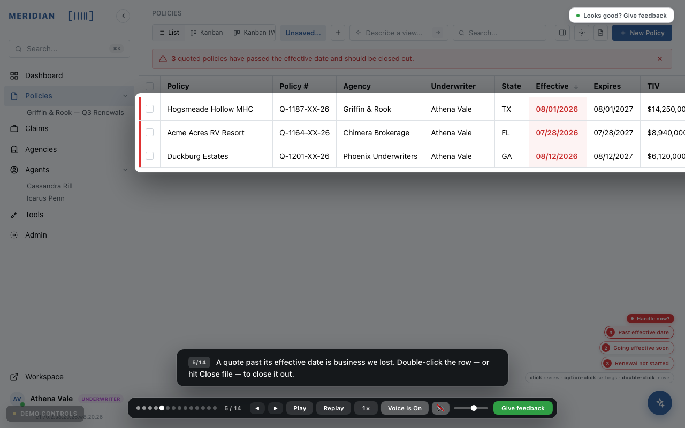

# feature-walkthrough

A Claude Code skill that turns a codebase and a description of a feature into a
narrated, self-playing walkthrough of that feature — as if it already existed.

The output is one HTML file. No build step, no dependencies, no server, no network
calls. Send it to a customer and they double-click it.



## The problem it solves

A customer asks for a feature. You think you understood. You build it for three
weeks and find out you did not.

The usual defences are a written spec nobody reads to the end, or a static mockup
that shows what it looks like but not what it does. Neither reliably catches the
misunderstanding, because neither makes the customer *feel* the feature.

This makes the thing you would have built, before you build it — styled to look
like their actual application, playing itself, narrated a step at a time — and then
asks them, in the file, whether it is right.

An hour of work to find out you misheard, instead of three weeks.

## What it produces

A page that opens with a card saying "this is what we think we heard", then plays
itself:

- a caption appears at the top, one idea at a time
- a spotlight grows out of the caption onto the exact element being described,
  dimming everything else
- the screen actually moves — lists filter, panels open, settings cycle through real
  values and the numbers change while you watch
- the viewer can pause, step, jump to any point, or replay
- at the end it asks: does this look right? Their answer comes back as copyable
  text, a downloadable file, or a pre-filled email

The screen is not a generic template. The skill reads the target codebase for its
real theme values, its real component shapes and its real domain vocabulary, so it
looks like the customer's own product and speaks in their own words.

## Install

Clone into your Claude Code skills directory:

```bash
git clone https://github.com/jaymenna/feature-walkthrough.git \
  ~/.claude/skills/feature-walkthrough
```

Or for one project only, clone it into that project's `.claude/skills/` instead.

Then in Claude Code:

```
/feature-walkthrough
```

It will ask you for two things: the path to the codebase, and what the feature
should do. That is all it needs.

## Try it first

Open `how-it-works.html` in a browser. It explains this skill, using this skill:
a walkthrough of what actually happens when you invoke it, start to finish. It was
built with the template in this repository.

Then open `example/expiring-quotes-walkthrough.html`, a complete walkthrough of a
real feature — an alert system for an insurance underwriting platform. It takes
about a minute to play, and `example/README.md` explains why it is built the way
it is.

## What is in here

```
SKILL.md                              the skill Claude Code reads
how-it-works.html                     this skill, explained using this skill
template/walkthrough-template.html    the engine, with five slots to fill
reference/reading-the-codebase.md     extracting theme, components and vocabulary
reference/writing-the-tour.md         scripting a walkthrough people watch to the end
reference/verifying.md                confirming it works before you send it
reference/sharing-the-result.md       optional webhooks and hosting
example/                              a complete worked example
```

The template runs as-is with a placeholder screen, so you can open it and watch the
engine work before putting anything of your own into it.

## Using the engine without Claude

`template/walkthrough-template.html` is a normal HTML file. Everything marked YOURS
is yours to fill in by hand; everything marked ENGINE can be left alone. If you
would rather write the tour yourself, the template is a perfectly good starting
point on its own.

The interesting part of the engine is the spotlight. `#spot` has no background of
its own — a 9999-pixel box-shadow spread darkens the entire screen around it, so
whatever sits inside the hole stays fully lit and readable. The highlight is born at
the caption and grows out to the element being described, so the two read as one
gesture rather than two separate things happening.

## Design decisions worth knowing about

**One file, always.** No CDN links, no fetched fonts, no frameworks. It has to work
on a laptop with no internet, opened from a file path, years from now.

**Fake the data, never the vocabulary.** Invent the company names and the amounts.
Never invent what the product calls things. Getting a customer's own words wrong is
exactly what makes a mockup feel like it was made by someone who was not listening.

**Nothing is sent anywhere by default.** The review stays in the browser until the
reviewer presses Copy, Download or Email. An optional webhook exists for teams that
want reviews to arrive automatically, and it points at your infrastructure, not
anyone else's.

**It does not touch the codebase it reads.** This is a drawing of a feature, not an
implementation.

## Credit

The engine came out of a working process at Underwriters Technologies for getting
sign-off on feature requests before building them. It is published here because it
turned out to be useful and there is no reason to keep it.

## Licence

MIT. See [LICENSE](LICENSE).
